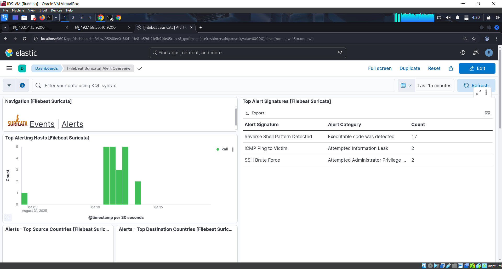
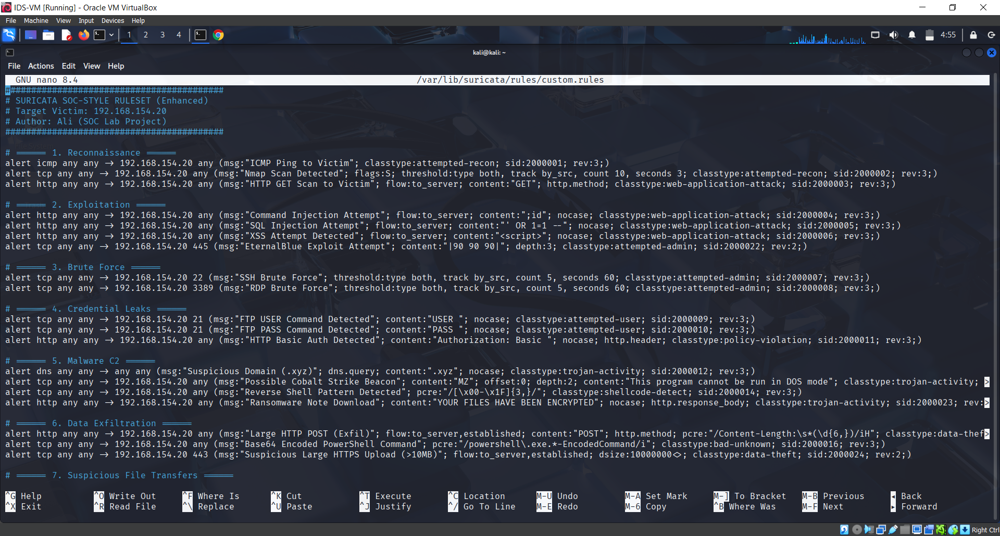
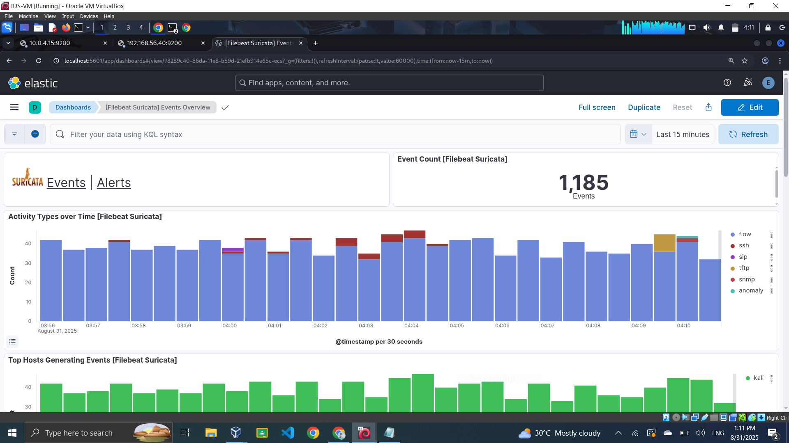
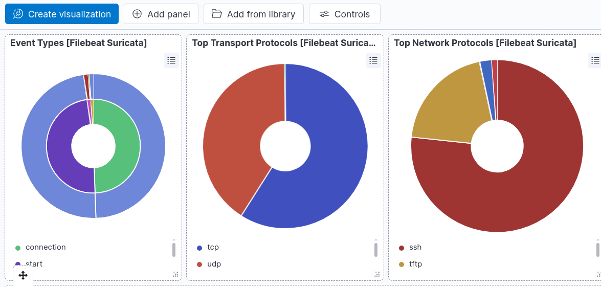

# SOC Lab: Suricata + ELK

A small SOC I built on VirtualBox to practice detection end to end: attack a vulnerable box from Kali, catch it with Suricata using rules I wrote myself, and investigate the alerts in Kibana.



## Lab setup

| VM | Role |
| --- | --- |
| Kali Linux | Attacker |
| Metasploitable | Victim (`192.168.154.20`) |
| Kali Linux + Suricata 7.0 | IDS, all attacker to victim traffic is routed through it |
| ELK (Elasticsearch, Logstash, Kibana) | Storage and dashboards |

Suricata writes EVE JSON, Filebeat ships it into Elasticsearch, and the Filebeat Suricata module gives you the Events and Alerts dashboards in Kibana.

```
Kali (attacker) ──▶ IDS VM (Suricata) ──▶ Metasploitable (victim)
                         │
                    eve.json
                         │
                     Filebeat ──▶ Elasticsearch ──▶ Kibana
```

## Detection rules

[`rules/custom.rules`](rules/custom.rules) has 30 rules across 10 categories:

- **Recon**: ICMP sweeps, Nmap SYN scans, HTTP scanning
- **Exploitation**: command injection, SQLi, XSS, EternalBlue
- **Brute force**: SSH and RDP (thresholded per source)
- **Credential leaks**: cleartext FTP USER/PASS, HTTP Basic auth
- **Malware / C2**: suspicious TLDs, PE files over the wire, reverse shell patterns, ransom notes
- **Exfiltration**: large POSTs, encoded PowerShell, big HTTPS uploads
- **File transfers, persistence, phishing, lateral movement**: zip/rar/exe downloads, `schtasks`, `reg add`, `wmic`, SMB named pipes, DCOM



## Running it yourself

1. Copy the rules onto the IDS box and change `192.168.154.20` to your victim's IP:
   ```bash
   sudo cp rules/custom.rules /var/lib/suricata/rules/custom.rules
   ```
2. Add `custom.rules` under `rule-files:` in `/etc/suricata/suricata.yaml`, then start Suricata on the interface that sees the traffic:
   ```bash
   sudo suricata -i eth0 -c /etc/suricata/suricata.yaml
   ```
3. Enable the Filebeat Suricata module and point it at `/var/log/suricata/eve.json`:
   ```bash
   sudo filebeat modules enable suricata
   sudo filebeat setup
   sudo systemctl start filebeat
   ```
4. Open Kibana and look for `[Filebeat Suricata] Alert Overview`. Then run something from Kali (`nmap -sS`, `hydra` against SSH, etc.) and watch it show up.

## Screenshots

| Events overview | Protocol breakdown |
| --- | --- |
|  |  |

The full write-up with every attack I ran and what fired is in [`docs/IDS_Project_Report.docx`](docs/IDS_Project_Report.docx).

## Things I'd change

These rules were written to learn, not to run in production. If I did it again:

- Use SIDs in the 1,000,000 range. 2,000,000+ belongs to Emerging Threats and can clash if you load ET Open next to these.
- Some rules are very noisy on purpose. "HTTP GET Scan" fires on every GET, and the phishing rule fires on any URI with `login` in it.
- Replace the IP hardcoded in every rule with `$HOME_NET` variables.
- Most of the content matches are easy to evade (e.g. `' OR 1=1 --`). Real coverage would come from ET Open plus a few targeted local rules.
